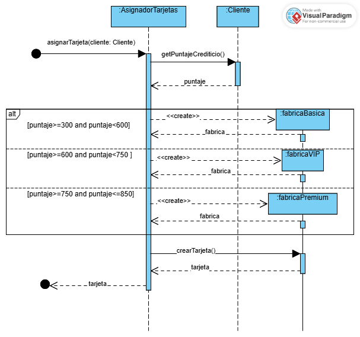

# DesignPatterns
Repositorio destinado a la implementación de los Patrones de Diseño identificados en el sistema de software de una tienda minorista.

Factory Method - Gabriel Tumbaco
.png>)

Decorator - Darwin Diaz y Pedro Barahona 

Facade - Geovanny Diaz

